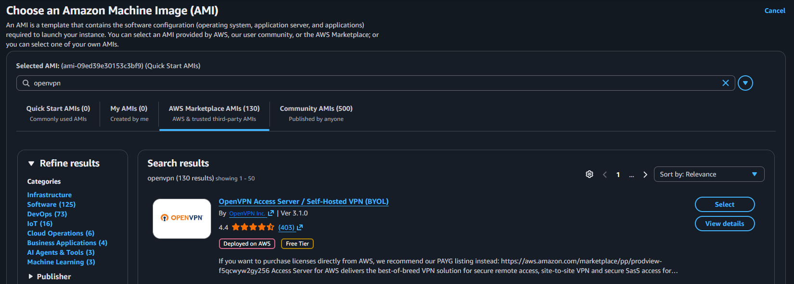
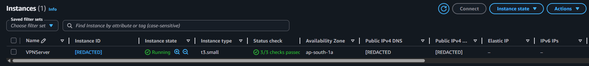
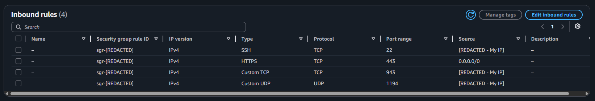
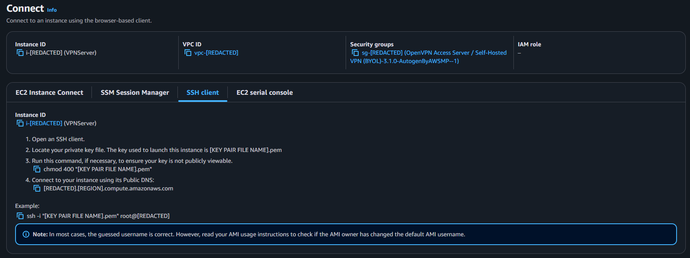
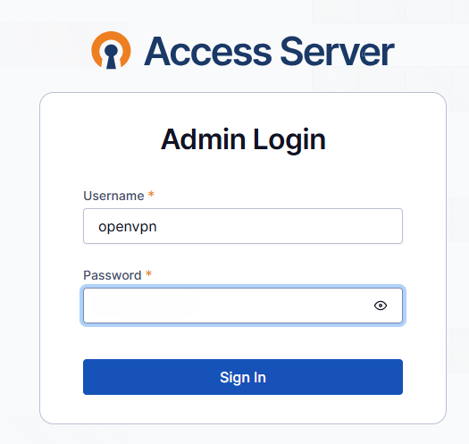
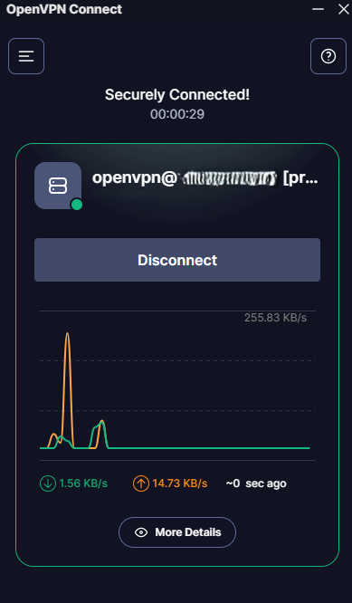
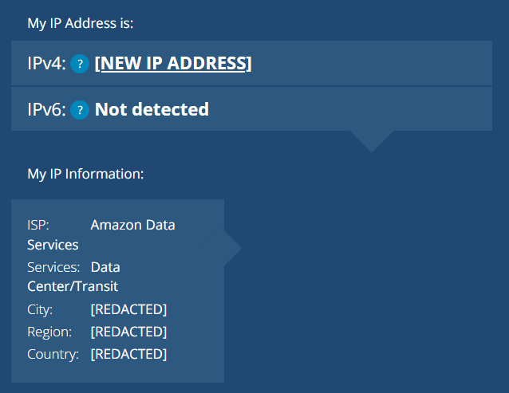

# AWS OpenVPN Lab

## Overview

This project documents the deployment of a self-hosted VPN server on Amazon Web Services using OpenVPN Access Server. The goal of this lab was to understand how cloud-hosted VPN infrastructure works, including EC2 provisioning, AWS Marketplace AMI deployment, SSH key authentication, security group configuration, OpenVPN admin setup, VPN client profiles, NAT routing, and connection testing.

This was completed as a hands-on cloud networking and cybersecurity lab.

## Project Summary

In this lab, I deployed an OpenVPN Access Server instance on AWS EC2 and configured it as a VPN endpoint. After completing the initial server setup, I connected to the VPN from a local device using OpenVPN Connect and verified that my public IP address changed to the AWS-hosted VPN server's IP address.

## Technologies Used

- Amazon Web Services
- Amazon EC2
- AWS Marketplace
- AWS VPC
- AWS Security Groups
- OpenVPN Access Server
- OpenVPN Connect
- SSH
- PowerShell
- Linux server administration

## Lab Architecture

```txt
Local Client Device
OpenVPN Connect
        |
        | Encrypted VPN Tunnel
        |
Internet
        |
AWS EC2 Instance
OpenVPN Access Server
        |
AWS VPC
```

For a fuller diagram, see [`diagrams/architecture.md`](diagrams/architecture.md).

## Main Steps Completed

1. Opened the AWS EC2 dashboard.
2. Launched a new EC2 instance.
3. Selected the OpenVPN Access Server AMI from AWS Marketplace.
4. Used the OpenVPN BYOL option with free access for two connected devices.
5. Selected the `t3.small` instance type for the lab environment.
6. Configured network settings, including VPC, subnet, public IP assignment, and security group inbound rules.
7. Created and downloaded an SSH key pair.
8. Connected to the server through PowerShell using SSH.
9. Accepted the OpenVPN Access Server license agreement.
10. Completed the OpenVPN Initial Configuration Tool setup.
11. Created the `openvpn` Admin UI password during the initial setup process.
12. Logged into the OpenVPN Admin UI.
13. Enabled routing of client internet traffic through the VPN.
14. Logged into the OpenVPN client portal.
15. Used OpenVPN Connect to connect to the VPN profile.
16. Verified VPN functionality by checking that the public IP address changed to an AWS-hosted endpoint.

## Important Ports

| Purpose | Protocol | Port |
|---|---:|---:|
| SSH administration | TCP | 22 |
| OpenVPN web/admin portal | TCP | 943 |
| HTTPS VPN access | TCP | 443 |
| OpenVPN tunnel traffic | UDP | 1194 |

## Screenshots

The screenshots below are redacted to hide public IP addresses, public DNS names, AWS resource IDs, key pair names, and other sensitive details.

### AWS Marketplace AMI Selection



### EC2 Instance Running



### Security Group Inbound Rules



### SSH Connection Wizard



### OpenVPN Admin Login



### OpenVPN Client Connected



### VPN Public IP Verification



## Repository Contents

| Path | Purpose |
|---|---|
| [`docs/setup-process.md`](docs/setup-process.md) | Step-by-step deployment process based on the lab |
| [`docs/technical-notes.md`](docs/technical-notes.md) | Explanation of the main VPN, EC2, routing, and authentication concepts |
| [`docs/security-considerations.md`](docs/security-considerations.md) | Security risks, redaction rules, and hardening notes |
| [`docs/troubleshooting.md`](docs/troubleshooting.md) | Common issues and fixes |
| [`docs/future-improvements.md`](docs/future-improvements.md) | Ways to improve the lab beyond the tutorial |
| [`diagrams/architecture.md`](diagrams/architecture.md) | Text-based architecture diagram |
| [`screenshots/`](screenshots/) | Redacted screenshots showing lab evidence |

## Security Notes

This lab involved security-sensitive files and credentials. The following items are intentionally excluded from this repository:

- AWS `.pem` private key files
- OpenVPN client profiles
- OpenVPN passwords
- AWS account identifiers
- Public IP addresses
- Private IP addresses
- Unredacted screenshots
- Server configuration files containing secrets

## What I Learned

Through this lab, I learned how to:

- Deploy OpenVPN Access Server on AWS EC2
- Use an AWS Marketplace AMI
- Connect to a cloud server using SSH key authentication
- Configure OpenVPN Access Server through its Admin UI
- Understand the difference between the Linux `openvpnas` user and the OpenVPN `openvpn` admin user
- Route client internet traffic through the VPN
- Verify VPN functionality through public IP testing
- Identify security risks related to exposed admin portals and cloud firewall rules

## Future Improvements

Future improvements could include:

- Restrict SSH access to my own IP address
- Restrict OpenVPN Admin UI access to trusted IP addresses
- Add a private EC2 instance accessible only through the VPN
- Automate the deployment using Terraform
- Add AWS CloudWatch monitoring
- Compare OpenVPN with WireGuard
- Add a cost breakdown for running the lab
- Apply additional Linux hardening controls

## Disclaimer

This project was completed for educational purposes as a cloud security and networking lab. No private keys, VPN profiles, passwords, or sensitive AWS account information are included in this repository.
